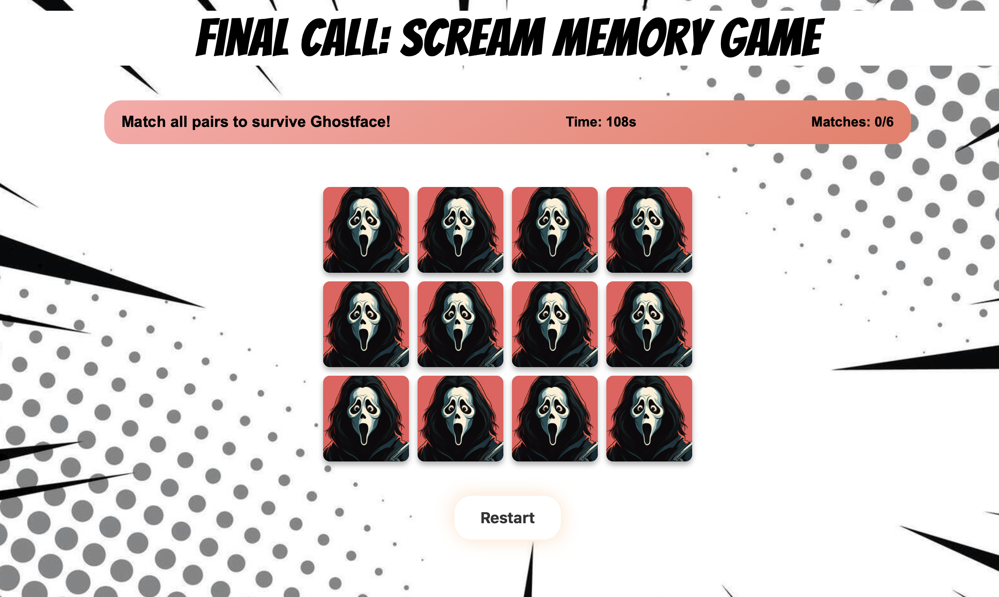

# Final Call: Scream Memory Game

---

## Game Preview

---

## Overview
Based on the iconic horror franchise *Scream*, this memory game challenges players to test their memory and reflexes by matching pairs of chilling images and quotes from the films. Immerse yourself in a thrilling blend of horror and humor as you race against the clock to escape Ghostface's clutches.

---

## Gameplay Features

### Card Matching Mechanic
- Flip two cards at a time and try to match pairs. Correct matches bring you closer to victory, while mismatches reset the cards.

### Timer
- You have **120 seconds** to match all pairs and survive. Game over if time runs out!

### Dynamic Shuffling
- The cards are shuffled randomly every game, ensuring a fresh and exciting experience each time you play.

### Real-Time Feedback
- Track the number of matches and time remaining as you play.

### Visual and Audio Design
- **Theme:** A unique combination of slasher horror with a comic twist, accompanied by Knife Party's *Internet Friends* for an adrenaline-filled mood.
- **Scream-Themed Cards:** AI-generated images bring a fresh and humorous take on the *Scream* universe.

---

## How to Play
1. Start the game and watch the cards shuffle randomly.
2. Flip two cards at a time to reveal their backs.
3. Match pairs to progress, or watch as mismatched cards reset.
4. Match all pairs before the timer hits zero to escape Ghostface and win the game!

---

## Conclusion
Do you have what it takes to survive? Test your memory and knowledge of *Scream* in this fast-paced, high-stakes game. Will you escape or fall victim to Ghostface? **Play now and find out!**

---
